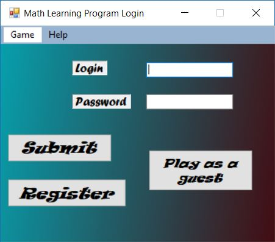
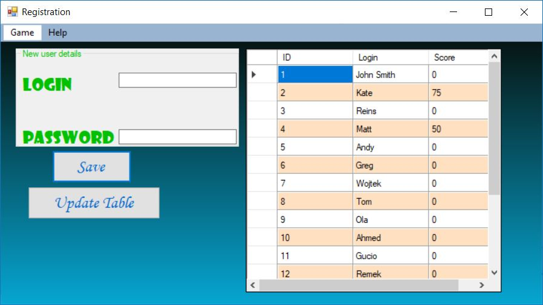
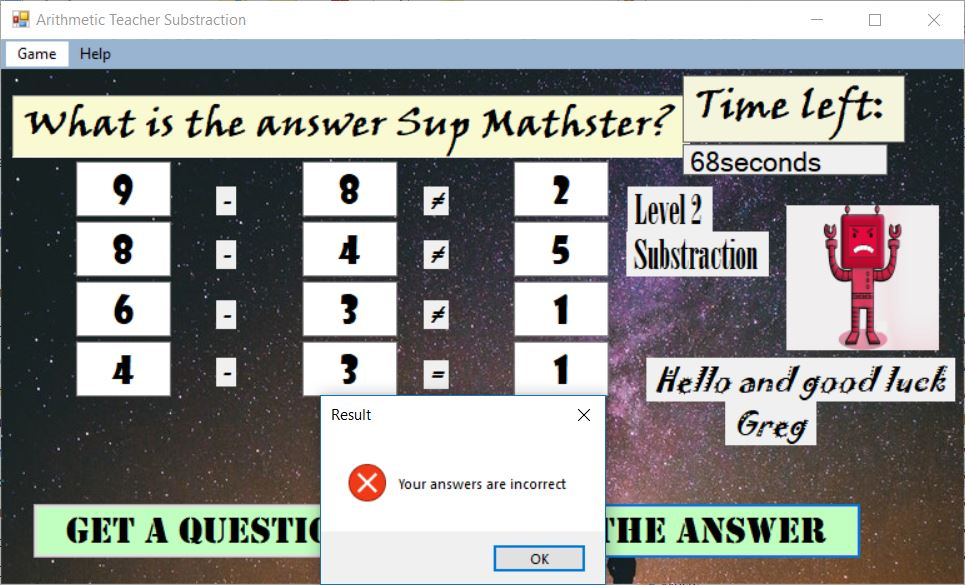

# Arithmetic-Teacher
This program is a simple mathematics quiz for children and it aims to teach basic arithmetic skills. It is written in C# and is built on WinForms class library.
## Main features:
- 4 basic arithmetic operation.
- 2 difficulty levels.
- Registering and logging students.
- Points System.
- Timer
- External Access database that could be used for teachers to access and modify.
- Option to print "Certificate" or save it as PDF file after accomplishing the quiz.

## Screnshots:

